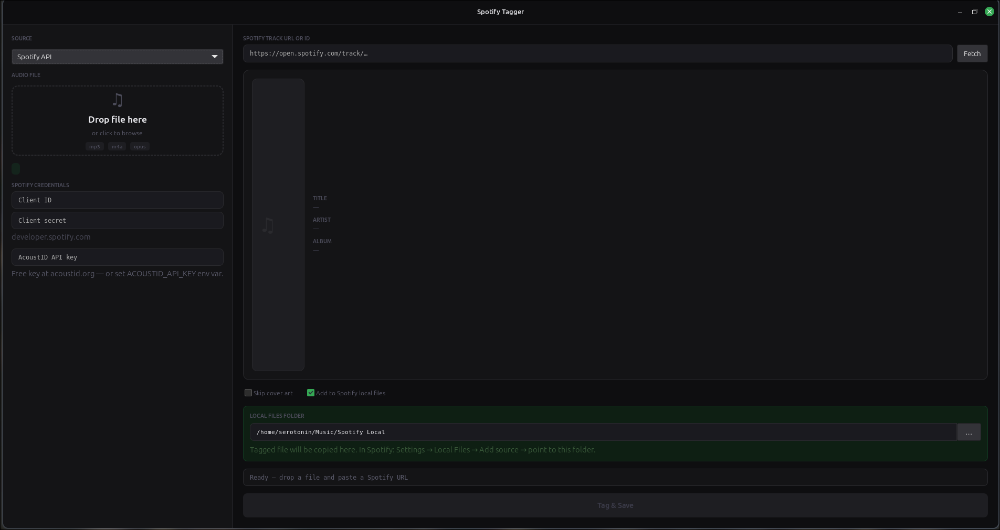

# SpotTagger

A modern Python application for tagging local audio files with accurate metadata using Spotify or AcoustID audio fingerprinting.

Supports both a GTK desktop interface and a command-line workflow.

## Why SpotTagger?

Managing local music libraries can be tedious.

SpotTagger automatically fills in missing metadata—including title, artist, album, and cover artwork—using either Spotify's Web API or AcoustID audio fingerprinting, making your local music library clean and organized.

## Features

-  Tag MP3, M4A and Opus files
-  Embed high-quality album artwork
-  Retrieve metadata directly from Spotify
-  Identify songs using AcoustID fingerprinting
-  Native GTK desktop interface
-  Full command-line interface
-  Copy tracks to Spotify Local Files

## Built With

- Python
- GTK3 (PyGObject)
- Spotipy
- Mutagen
- AcoustID
- MusicBrainz
  
## Screenshots

### GTK Interface



-  Tag MP3, M4A and Opus files
-  Embed high-quality album artwork
-  Retrieve metadata directly from Spotify
-  Identify songs using AcoustID fingerprinting
-  Native GTK desktop interface
-  Full command-line interface
-  Copy tracks to Spotify Local Files


## Quick Start

### 1. Setup

```bash
./setup.sh
```

This creates a virtualenv and installs dependencies.

### 2. Get API Keys

- **Spotify mode:** Create an app at https://developer.spotify.com, grab the Client ID and Secret
- **AcoustID mode:** Get a free API key at https://acoustid.org/

**System dependency:** AcoustID fingerprinting needs `libchromaprint`:

```bash
# Debian / Ubuntu / Mint
sudo apt install libchromaprint-dev

# Arch
sudo pacman -S chromaprint
```

### 3. Use It

#### CLI

```bash
# Spotify mode
./stag song.mp3 https://open.spotify.com/track/... --id CLIENT_ID --secret CLIENT_SECRET

# AcoustID mode (no Spotify credentials)
export ACOUSTID_API_KEY=your_key
./stag song.mp3 --acoustid
```

#### GUI

```bash
./launch.sh
```

## CLI Reference

```
usage: spotify_tagger.py [-h] [--id CLIENT_ID] [--secret CLIENT_SECRET]
                         [--no-cover] [--acoustid]
                         [--acoustid-api-key ACOUSTID_API_KEY]
                         audio [track]

positional arguments:
  audio                 Path to the audio file (.mp3, .m4a, .opus)
  track                 Spotify track URL or ID (not needed with --acoustid)

options:
  --id CLIENT_ID        Spotify Client ID (or SPOTIPY_CLIENT_ID env var)
  --secret CLIENT_SECRET  Spotify Client Secret (or SPOTIPY_CLIENT_SECRET env var)
  --no-cover            Skip embedding cover art
  --acoustid            Use AcoustID fingerprinting instead of Spotify API
  --acoustid-api-key KEY  AcoustID API key (or ACOUSTID_API_KEY env var)
```

## Project Structure

```
├── spotify_tagger.py       # Core CLI — tagging logic
├── spotify_tagger_app.py   # GTK3 GUI
├── setup.sh                # One-shot setup (creates venv, installs deps)
├── launch.sh               # GUI launcher
├── stag                    # CLI launcher
├── spotify-tagger.desktop  # Linux .desktop entry (SpotTagger)
├── docs/
│   └── images/
│       └── main-window.png # GUI screenshot
└── README.md
```
